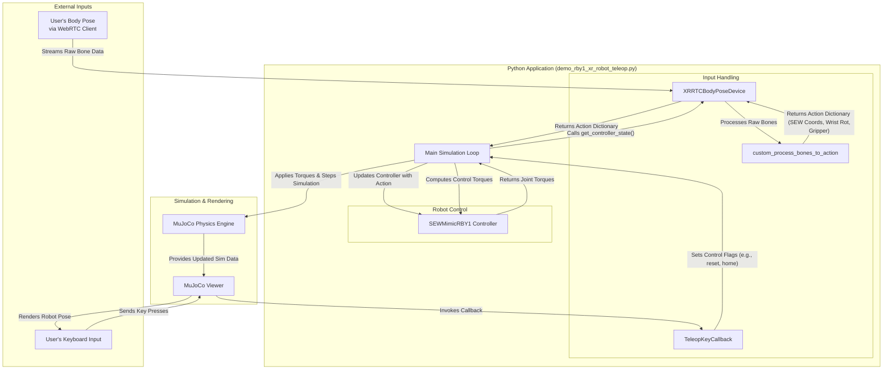
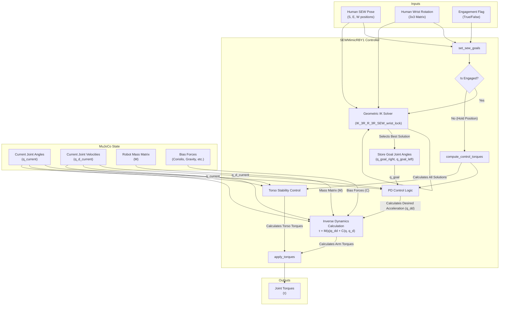

# System Diagram for RBY1 XR Robot Teleoperation

This diagram illustrates the interaction between the different components of the `demo_rby1_xr_robot_teleop.py` script.

## Component Descriptions

-   **User's Body Pose (WebRTC)**: The source of the human motion data, captured by a camera and processed by a WebRTC client in a browser.
-   **User's Keyboard Input**: Provides manual control over the simulation (e.g., resetting, quitting, toggling teleop).
-   **XRRTCBodyPoseDevice**: A Robosuite device client that receives the body pose data (bones) from the WebRTC server.
-   **custom_process_bones_to_action**: A function that converts the raw bone data from world coordinates into a robot-centric action dictionary (containing SEW coordinates, wrist rotations, and gripper states).
-   **TeleopKeyCallback**: A callback class that handles keyboard inputs from the MuJoCo viewer to control the simulation state.
-   **Main Simulation Loop**: The core loop that orchestrates the entire process: fetching actions, updating the controller, stepping the physics simulation, and rendering.
-   **SEWMimicRBY1 Controller**: The controller that takes the desired SEW (Shoulder-Elbow-Wrist) coordinates and computes the necessary joint torques to make the RBY1 robot mimic the motion.
-   **MuJoCo Physics Engine**: The underlying engine that simulates the robot's dynamics and physics.
-   **MuJoCo Viewer**: The passive viewer that renders the simulation and captures keyboard inputs.

## Files Used

| File | Description | Inputs | Outputs |
| --- | --- | --- | --- |
| `demo_rby1_xr_robot_teleop.py` | Main script that orchestrates the entire teleoperation demo. | Keyboard inputs for simulation control (reset, quit, etc.), command-line arguments (`--max_fr`). | Initializes and runs the MuJoCo simulation, renders the robot. |
| `robosuite/devices/xr_robot_teleop_client.py` | Defines the `XRRTCBodyPoseDevice` class. | Raw bone data from the WebRTC stream. | An action dictionary containing SEW coordinates, wrist rotation, and gripper state. |
| `sew_mimic_rby1.py` | Defines the `SEWMimicRBY1` controller class. | Target SEW coordinates and wrist rotations for both arms. | Joint torques for the RBY1 robot. |
| `robosuite/projects/rby1_teleop/rby1a/mujoco/model.xml` | MuJoCo XML model file. | This file is read by the MuJoCo engine. | A `MjModel` object that defines the robot's structure and physics properties for the simulation. |
| `xr_robot_teleop_server/schemas/body_pose.py` | Defines the `Bone` data schema. | (Implicit) Structures the incoming bone data from the WebRTC client. | A structured `Bone` object used within the application. |
| `xr_robot_teleop_server/schemas/openxr_skeletons.py` | Defines the `FullBodyBoneId` enum. | (Implicit) Provides identifiers for each bone. | Enum members (`FullBodyBoneId`) for accessing specific bones. |

# System Diagram for SEWMimicRBY1 Controller

This diagram details the internal workings of the `SEWMimicRBY1` controller defined in `sew_mimic_rby1.py`.

## Controller Logic Breakdown

1.  **Goal Setting (`set_sew_goals`)**: The controller receives the target SEW (Shoulder-Elbow-Wrist) positions, wrist rotation, and an engagement flag.
2.  **Engagement Check**: If the `engaged` flag is `False`, the controller skips the IK step and proceeds to compute "holding" torques to keep the robot stationary.
3.  **Geometric IK Solver**: If `engaged`, the controller calls the `IK_3R_R_3R_SEW_wrist_lock` function. This function takes the human's pose and the robot's kinematic model to solve for the required joint angles (`q_goal`) that will achieve that pose. It's designed to find a consistent solution to avoid jerky movements.
4.  **Torque Computation (`compute_control_torques`)**: This is the core of the controller, executed on every simulation step.
    -   **PD Control**: It calculates the error between the goal joint angles (`q_goal`) and the current joint angles (`q_current`) from the MuJoCo simulation. It uses a Proportional-Derivative (PD) control law to determine the desired joint acceleration (`q_dd`).
    -   **Inverse Dynamics**: Instead of just applying forces based on PD error, it uses the full inverse dynamics model: **&tau; = M(q)q_dd + C(q, q_d)**.
        -   It gets the robot's current **Mass Matrix (M)** and **Bias Forces (C)** (which include gravity, Coriolis, and centrifugal forces) directly from MuJoCo.
        -   This allows it to calculate the precise **torques (&tau;)** needed to achieve the desired acceleration, resulting in much more stable and accurate control.
    -   **Torso Stability**: A separate, simpler PD controller calculates torques to hold the torso joints in their initial position, preventing unwanted body movement.
5.  **Apply Torques (`apply_torques`)**: The final computed torques for the arms and torso are applied to the robot's actuators in the MuJoCo simulation.
