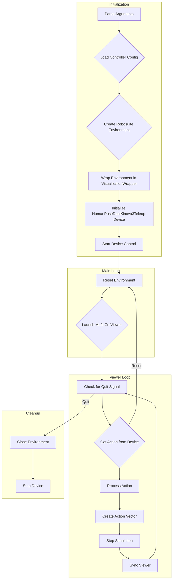
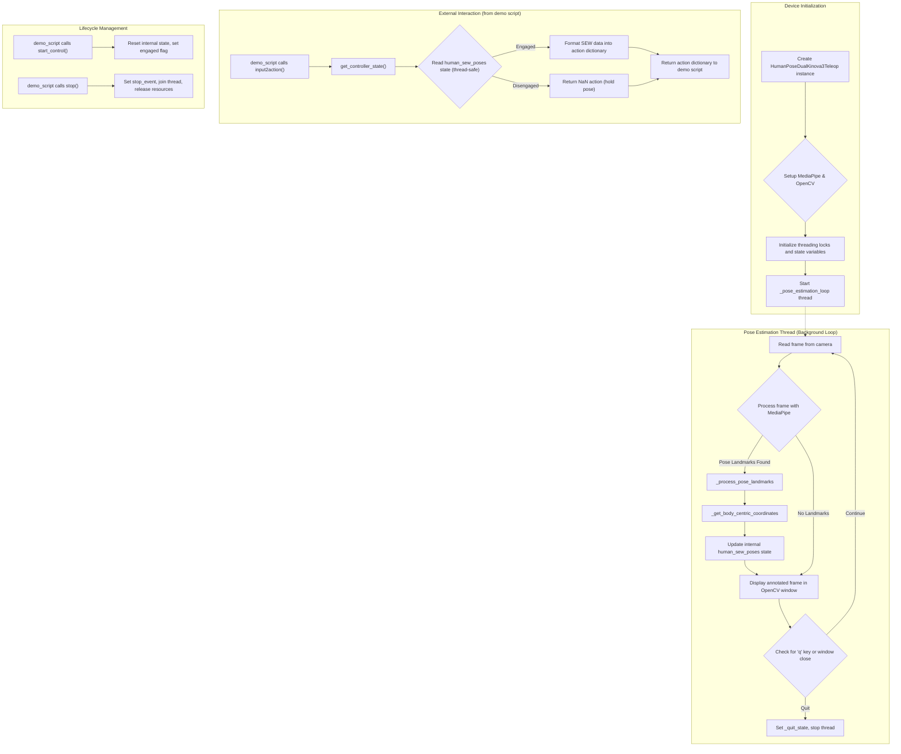

---

### `human_pose_dualkinova3_teleop_device.py`



```
╭────────────────────────────────────────────╮
│  > Could you explain the threading model?  │
╰────────────────────────────────────────────╯

✦ Of course. The threading model is a classic producer-consumer pattern designed to keep the simulation running smoothly without being blocked by the camera and pose estimation processing.

  Here's a breakdown:

   1. Main Thread (The Consumer):
       * This is the primary thread where demo_dual_kinova3_software_human_pose_teleop.py runs.
       * Its main responsibility is to run the MuJoCo physics simulation loop (env.step()) and update the viewer (viewer.sync()).
       * In each simulation step, it consumes the latest pose data by calling device.input2action(). This call needs to be fast and non-blocking to maintain a high simulation frame rate.

   2. Pose Estimation Thread (The Producer):
       * This thread is created and managed entirely within the HumanPoseDualKinova3Teleop device class.
       * It runs the _pose_estimation_loop function in the background.
       * Its sole responsibility is to continuously produce pose data by:
           * Reading a frame from the webcam.
           * Processing the frame with the MediaPipe library.
           * Calculating the body-centric SEW (Shoulder, Elbow, Wrist) coordinates.
           * Updating an internal shared variable (self.human_sew_poses) with the latest coordinates.

  Synchronization

  The two threads work on shared data (self.human_sew_poses), so they need to be synchronized to prevent race conditions (where one thread tries to read the data while the other is in the middle of writing it).

  This is achieved using a threading.Lock (self.controller_state_lock):

   * When Writing: The Pose Estimation Thread acquires the lock before updating self.human_sew_poses and releases it immediately after.
   * When Reading: The Main Thread (via the input2action -> get_controller_state call stack) acquires the same lock before reading from self.human_sew_poses and releases it immediately after.

  This ensures that the main simulation thread always gets a complete, non-corrupted set of pose coordinates, while the pose estimation thread can work independently in the background. The use of timeouts on the lock acquisition prevents the application from freezing if
  one thread holds the lock for too long.
```

```
╭────────────────────────────────────────────────────────────────╮
│  > Is `self.stop_event.is_set()` the way the lock is handled?  │
╰────────────────────────────────────────────────────────────────╯

✦ No, that's a great question because it touches on two distinct but important threading concepts.

  self.stop_event.is_set() is not for handling the lock. They serve two different purposes:

   1. `self.controller_state_lock` (A `threading.Lock`): Data Protection
       * Purpose: To prevent data corruption. It ensures that only one thread can access the shared data (self.human_sew_poses) at any given moment.
       * Analogy: Think of it as a key to a room.
       * How it works:
           * When the pose estimation thread wants to write new coordinates, it must first acquire the lock: self.controller_state_lock.acquire().
           * When the pose estimation thread wants to write new coordinates, it must first acquire the lock: self.controller_state_lock.acquire().
           * When the main simulation thread wants to read those coordinates, it also must acquire the lock.
           * If one thread has the lock, the other thread must wait until the first one is finished and releases the lock. This prevents the main thread from reading a half-written, incomplete set of coordinates.

   2. `self.stop_event` (A `threading.Event`): Signaling
       * Purpose: To tell the background thread when it's time to stop running.
       * Analogy: Think of it as a traffic light.
       * How it works:
           * The pose estimation thread runs inside a while not self.stop_event.is_set(): loop. Initially, the "light" is green (is_set() is False).
           * When you want to close the application, the main thread calls the device.stop() method.
           * Inside stop(), self.stop_event.set() is called. This turns the "light" red (is_set() becomes True).
           * On the next iteration of its loop, the background thread sees the red light, the while condition becomes false, and the loop terminates, allowing the thread to clean up and exit gracefully.

  In Short:

   * Lock (`controller_state_lock`): Manages access to shared data for brief, critical moments. It's about preventing simultaneous access.
   * Event (`stop_event`): Manages the lifecycle of the thread. It's a one-way signal to stop.
```

```
╭──────────────────────────────────────────────────────────────────────────────────────────────────────────────────────────────────────────────────────────────────────────────────────────────────────────────────────────────────────────────────────────────────╮
│  > Ah, so it seems like the lock is used specifically when modifying the shared data, but doesn't need to be used when the human pose estimator worker thread updates its internal data (like fetching a new frame from webcam and running mediapipe analysis)?  │
╰──────────────────────────────────────────────────────────────────────────────────────────────────────────────────────────────────────────────────────────────────────────────────────────────────────────────────────────────────────────────────────────────────╯

✦ Yes, that is exactly correct. You've grasped the core principle of efficient multithreaded programming perfectly.

  The lock is used only for the "critical section"—the smallest possible piece of code that accesses the data shared between threads.

  Here’s the workflow of the pose estimation thread, highlighting where the lock is (and is not) used:

   1. Fetch New Frame (No Lock): ret, frame = self.cap.read()
       * This is a potentially slow I/O operation. The frame data is local to this thread, so no lock is needed.

   2. Run MediaPipe Analysis (No Lock): results = self.pose.process(rgb_frame)
       * This is a CPU-intensive operation. It works on the local rgb_frame and produces a local results object. The main thread doesn't know or care about these intermediate variables, so no lock is needed.

   3. Calculate Body-Centric Coordinates (No Lock): body_centric_coords = self._get_body_centric_coordinates(results)
       * All calculations are done using the local results object. Still no need for a lock.

   4. Update Shared State (Lock Acquired):
       * self.controller_state_lock.acquire(...)
       * The thread now has exclusive access to self.human_sew_poses.
       * It quickly writes the final, calculated coordinates into the shared self.human_sew_poses dictionary. This is a very fast operation (just a few dictionary assignments).
       * self.controller_state_lock.release()
       * The lock is released immediately.

  Why This is a Good Design

  By keeping the lock's duration to an absolute minimum, you maximize parallelism:

   * The main simulation thread is only ever blocked for the tiny fraction of a second it takes to read the dictionary.
   * The pose estimation thread can spend the vast majority of its time doing the slow work of camera capture and AI inference without ever blocking the main thread.
```