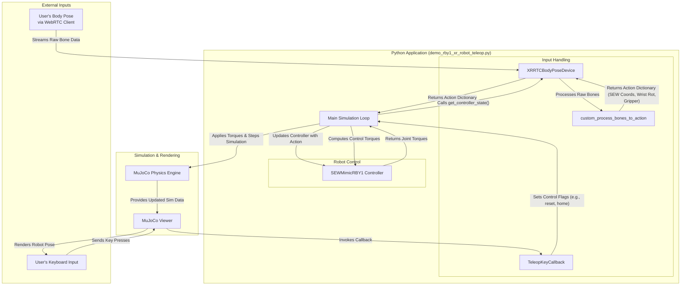

# System Diagram for RBY1 XR Robot Teleoperation

This diagram illustrates the interaction between the different components of the `demo_rby1_xr_robot_teleop.py` script.

## Component Descriptions

-   **User's Body Pose (WebRTC)**: The source of the human motion data, captured by a camera and processed by a WebRTC client in a browser.
-   **User's Keyboard Input**: Provides manual control over the simulation (e.g., resetting, quitting, toggling teleop).
-   **XRRTCBodyPoseDevice**: A Robosuite device client that receives the body pose data (bones) from the WebRTC server.
-   **custom_process_bones_to_action**: A function that converts the raw bone data from world coordinates into a robot-centric action dictionary (containing SEW coordinates, wrist rotations, and gripper states).
-   **TeleopKeyCallback**: A callback class that handles keyboard inputs from the MuJoCo viewer to control the simulation state.
-   **Main Simulation Loop**: The core loop that orchestrates the entire process: fetching actions, updating the controller, stepping the physics simulation, and rendering.
-   **SEWMimicRBY1 Controller**: The controller that takes the desired SEW (Shoulder-Elbow-Wrist) coordinates and computes the necessary joint torques to make the RBY1 robot mimic the motion.
-   **MuJoCo Physics Engine**: The underlying engine that simulates the robot's dynamics and physics.
-   **MuJoCo Viewer**: The passive viewer that renders the simulation and captures keyboard inputs.
