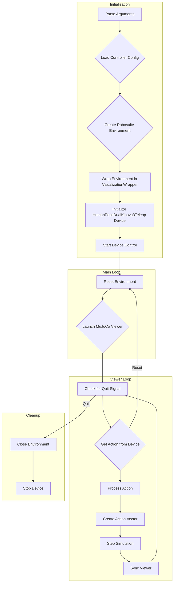
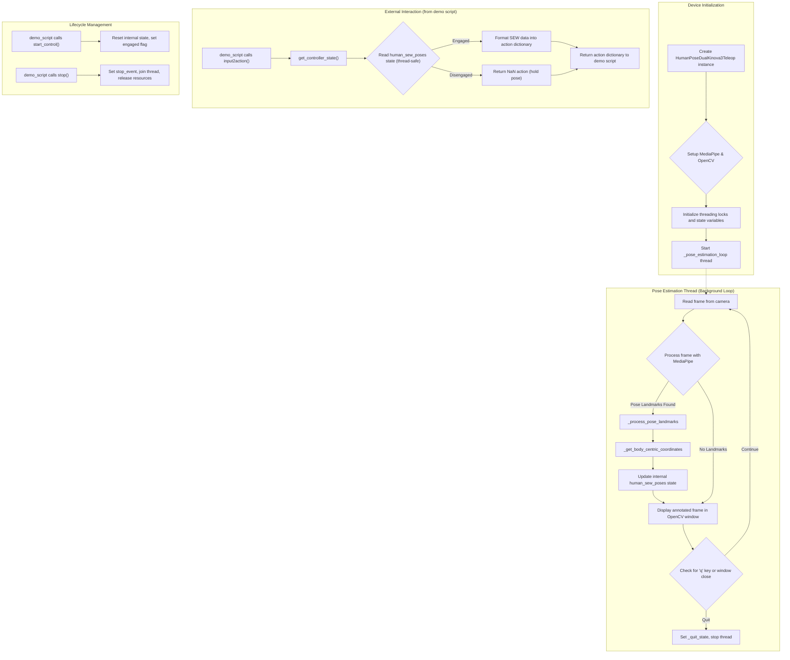

---

### `human_pose_dualkinova3_teleop_device.py`



```
╭────────────────────────────────────────────╮
│  > Could you explain the threading model?  │
╰────────────────────────────────────────────╯

✦ Of course. The threading model is a classic producer-consumer pattern designed to keep the simulation running smoothly without being blocked by the camera and pose estimation processing.

  Here's a breakdown:

   1. Main Thread (The Consumer):
       * This is the primary thread where demo_dual_kinova3_software_human_pose_teleop.py runs.
       * Its main responsibility is to run the MuJoCo physics simulation loop (env.step()) and update the viewer (viewer.sync()).
       * In each simulation step, it consumes the latest pose data by calling device.input2action(). This call needs to be fast and non-blocking to maintain a high simulation frame rate.

   2. Pose Estimation Thread (The Producer):
       * This thread is created and managed entirely within the HumanPoseDualKinova3Teleop device class.
       * It runs the _pose_estimation_loop function in the background.
       * Its sole responsibility is to continuously produce pose data by:
           * Reading a frame from the webcam.
           * Processing the frame with the MediaPipe library.
           * Calculating the body-centric SEW (Shoulder, Elbow, Wrist) coordinates.
           * Updating an internal shared variable (self.human_sew_poses) with the latest coordinates.

  Synchronization

  The two threads work on shared data (self.human_sew_poses), so they need to be synchronized to prevent race conditions (where one thread tries to read the data while the other is in the middle of writing it).

  This is achieved using a threading.Lock (self.controller_state_lock):

   * When Writing: The Pose Estimation Thread acquires the lock before updating self.human_sew_poses and releases it immediately after.
   * When Reading: The Main Thread (via the input2action -> get_controller_state call stack) acquires the same lock before reading from self.human_sew_poses and releases it immediately after.

  This ensures that the main simulation thread always gets a complete, non-corrupted set of pose coordinates, while the pose estimation thread can work independently in the background. The use of timeouts on the lock acquisition prevents the application from freezing if
  one thread holds the lock for too long.
```

```
╭────────────────────────────────────────────────────────────────╮
│  > Is `self.stop_event.is_set()` the way the lock is handled?  │
╰────────────────────────────────────────────────────────────────╯

✦ No, that's a great question because it touches on two distinct but important threading concepts.

  self.stop_event.is_set() is not for handling the lock. They serve two different purposes:

   1. `self.controller_state_lock` (A `threading.Lock`): Data Protection
       * Purpose: To prevent data corruption. It ensures that only one thread can access the shared data (self.human_sew_poses) at any given moment.
       * Analogy: Think of it as a key to a room.
       * How it works:
           * When the pose estimation thread wants to write new coordinates, it must first acquire the lock: self.controller_state_lock.acquire().
           * When the pose estimation thread wants to write new coordinates, it must first acquire the lock: self.controller_state_lock.acquire().
           * When the main simulation thread wants to read those coordinates, it also must acquire the lock.
           * If one thread has the lock, the other thread must wait until the first one is finished and releases the lock. This prevents the main thread from reading a half-written, incomplete set of coordinates.

   2. `self.stop_event` (A `threading.Event`): Signaling
       * Purpose: To tell the background thread when it's time to stop running.
       * Analogy: Think of it as a traffic light.
       * How it works:
           * The pose estimation thread runs inside a while not self.stop_event.is_set(): loop. Initially, the "light" is green (is_set() is False).
           * When you want to close the application, the main thread calls the device.stop() method.
           * Inside stop(), self.stop_event.set() is called. This turns the "light" red (is_set() becomes True).
           * On the next iteration of its loop, the background thread sees the red light, the while condition becomes false, and the loop terminates, allowing the thread to clean up and exit gracefully.

  In Short:

   * Lock (`controller_state_lock`): Manages access to shared data for brief, critical moments. It's about preventing simultaneous access.
   * Event (`stop_event`): Manages the lifecycle of the thread. It's a one-way signal to stop.
```

```
╭──────────────────────────────────────────────────────────────────────────────────────────────────────────────────────────────────────────────────────────────────────────────────────────────────────────────────────────────────────────────────────────────────╮
│  > Ah, so it seems like the lock is used specifically when modifying the shared data, but doesn't need to be used when the human pose estimator worker thread updates its internal data (like fetching a new frame from webcam and running mediapipe analysis)?  │
╰──────────────────────────────────────────────────────────────────────────────────────────────────────────────────────────────────────────────────────────────────────────────────────────────────────────────────────────────────────────────────────────────────╯

✦ Yes, that is exactly correct. You've grasped the core principle of efficient multithreaded programming perfectly.

  The lock is used only for the "critical section"—the smallest possible piece of code that accesses the data shared between threads.

  Here’s the workflow of the pose estimation thread, highlighting where the lock is (and is not) used:

   1. Fetch New Frame (No Lock): ret, frame = self.cap.read()
       * This is a potentially slow I/O operation. The frame data is local to this thread, so no lock is needed.

   2. Run MediaPipe Analysis (No Lock): results = self.pose.process(rgb_frame)
       * This is a CPU-intensive operation. It works on the local rgb_frame and produces a local results object. The main thread doesn't know or care about these intermediate variables, so no lock is needed.

   3. Calculate Body-Centric Coordinates (No Lock): body_centric_coords = self._get_body_centric_coordinates(results)
       * All calculations are done using the local results object. Still no need for a lock.

   4. Update Shared State (Lock Acquired):
       * self.controller_state_lock.acquire(...)
       * The thread now has exclusive access to self.human_sew_poses.
       * It quickly writes the final, calculated coordinates into the shared self.human_sew_poses dictionary. This is a very fast operation (just a few dictionary assignments).
       * self.controller_state_lock.release()
       * The lock is released immediately.

  Why This is a Good Design

  By keeping the lock's duration to an absolute minimum, you maximize parallelism:

   * The main simulation thread is only ever blocked for the tiny fraction of a second it takes to read the dictionary.
   * The pose estimation thread can spend the vast majority of its time doing the slow work of camera capture and AI inference without ever blocking the main thread.
```

```
╭──────────────────────────────────────────────────────────────────────────────────────────────────────────────────────────────────────────────────────────────────────────────────────────────────────────────────────────────╮
│  > Do you have any design/architecture recommendations, if I seek to implement a programmatically controlled camera (the virtual camera in mujoco being updated according to the pose of a VR headset) to the teleop setup?  │
╰──────────────────────────────────────────────────────────────────────────────────────────────────────────────────────────────────────────────────────────────────────────────────────────────────────────────────────────────╯

✦ Of course. That's an excellent idea for creating a more immersive teleoperation experience.

  Based on the existing architecture, here is a set of design recommendations to implement this feature in a clean, modular, and efficient way. The key is to follow the same non-blocking, producer-consumer pattern used by the HumanPose... device.

  High-Level Architecture

  You will create a new, independent "device" class, let's call it VRHeadsetDevice, that runs in its own background thread. Its sole job is to poll the VR headset for its pose. The main simulation thread will then consume this pose data each frame to update the MuJoCo
  viewer's camera.

  This decouples the VR hardware from the simulation loop, preventing slow VR API calls from blocking or slowing down the physics simulation.

  ---

  Step-by-Step Design Recommendations

  1. Create the VRHeadsetDevice Class

  This class will be responsible for all communication with the VR system.

   * Prerequisite: You'll need a library to interface with your headset, like pyopenvr or pyopenxr. You would pip install openvr.

   * Class Structure: Create a new file, e.g., robosuite/devices/vr_headset_device.py.

    1 # In robosuite/devices/vr_headset_device.py
    2 import openvr
    3 import threading
    4 import time
    5 import numpy as np
    6 
    7 class VRHeadsetDevice:
    8     def __init__(self):
    9         # 1. Initialize OpenVR
   10         openvr.init(openvr.VRApplication_Scene)
   11         self.vr_system = openvr.VRSystem()
   12 
   13         # 2. Threading and state management
   14         self.pose_lock = threading.Lock()
   15         self.stop_event = threading.Event()
   16 
   17         # 3. Shared data: position and orientation (as a 3x4 matrix)
   18         self.headset_pose = None
   19 
   20         # 4. Start the polling thread
   21         self.polling_thread = threading.Thread(target=self._vr_polling_loop)
   22         self.polling_thread.daemon = True
   23 
   24     def start(self):
   25         """Starts the background polling thread."""
   26         self.polling_thread.start()
   27 
   28     def stop(self):
   29         """Stops the background thread and cleans up OpenVR."""
   30         self.stop_event.set()
   31         self.polling_thread.join()
   32         openvr.shutdown()
   33 
   34     def _vr_polling_loop(self):
   35         """The background thread's main loop."""
   36         while not self.stop_event.is_set():
   37             # Poll OpenVR for the latest poses
   38             poses = []
   39             openvr.VRCompositor().waitGetPoses(poses, None)
   40 
   41             # The headset is always device index 0
   42             hmd_pose = poses[openvr.k_unTrackedDeviceIndex_Hmd].mDeviceToAbsoluteTracking
   43 
   44             # Acquire lock to update the shared data
   45             with self.pose_lock:
   46                 self.headset_pose = hmd_pose
   47
   48             # Sleep briefly to prevent busy-waiting (e.g., for a 90Hz headset)
   49             time.sleep(1/100)
   50
   51     def get_pose(self):
   52         """Public method for the main thread to get the latest pose."""
   53         with self.pose_lock:
   54             # Return a copy to prevent race conditions after the lock is released
   55             return self.headset_pose

  2. Integrate into the Main Teleop Script

  In demo_dual_kinova3_software_human_pose_teleop.py, you'll instantiate and manage this new device.

    1 # In your main script (e.g., demo_..._teleop.py)
    2 
    3 # ... other imports
    4 from robosuite.devices.vr_headset_device import VRHeadsetDevice # Import your new class
    5 
    6 if __name__ == "__main__":
    7     # ... argument parsing etc.
    8 
    9     # Initialize and start the VR headset device
   10     vr_device = VRHeadsetDevice()
   11     vr_device.start()
   12 
   13     # ... create environment, human pose device, etc.
   14 
   15     with mujoco.viewer.launch_passive(model, data) as viewer:
   16         # ... existing viewer setup ...
   17 
   18         # IMPORTANT: Set the camera to a "free" camera
   19         # This allows direct control over its position and orientation
   20         viewer.cam.type = mujoco.mjtCamera.mjCAMERA_FREE
   21 
   22         while viewer.is_running() and not env.done:
   23             # ... existing logic for getting robot actions ...
   24 
   25             # --- New Camera Control Logic ---
   26             vr_pose_matrix = vr_device.get_pose()
   27             if vr_pose_matrix is not None:
   28                 # This is the critical part: update the viewer camera
   29                 # You will need to handle coordinate system alignment here!
   30                 update_viewer_camera_from_vr(viewer, vr_pose_matrix)
   31             # --- End New Logic ---
   32 
   33             env.step(env_action)
   34             viewer.sync()
   35 
   36     # ... cleanup ...
   37     vr_device.stop() # Don't forget to stop the device
   38     device.stop()
   39     env.close()

  3. Implement the Camera Update Logic

  This is the most important part. The default MuJoCo camera orbits a point. For VR, you need a "free" camera that you can place anywhere with any orientation.

   * Set Camera Mode: As shown above, the first step is viewer.cam.type = mujoco.mjtCamera.mjCAMERA_FREE.
   * Coordinate System Alignment: This is a critical challenge. The OpenVR coordinate system will not match the MuJoCo world coordinate system. You need to find the transformation matrix that maps one to the other. A common way to do this is a one-time calibration step where
     you place the headset at a known point in the real world (e.g., the center of your play space) that corresponds to a known point in the simulation (e.g., [0, 0, 0]).
   * Update Function: Create a helper function to handle the transformation.

    1 def get_calibration_matrix(offset_pos, offset_yaw_degrees):
    2     """Creates a fixed transformation from VR space to MuJoCo space."""
    3     rotation = T.quat2mat(T.axisangle2quat([0, 0, 1], np.deg2rad(offset_yaw_degrees)))
    4     translation = np.array(offset_pos)
    5 
    6     calib_matrix = np.eye(4)
    7     calib_matrix[:3, :3] = rotation
    8     calib_matrix[:3, 3] = translation
    9     return calib_matrix
   10 
   11 # You would determine this once for your setup
   12 CALIBRATION_MATRIX = get_calibration_matrix(offset_pos=[0.5, 0, -1.0], offset_yaw_degrees=180)
   13 
   14 def update_viewer_camera_from_vr(viewer, vr_pose_matrix):
   15     """
   16     Updates the free camera's pose from the VR headset's pose matrix.
   17 
   18     Args:
   19         viewer: The mujoco.viewer instance.
   20         vr_pose_matrix (np.array): A 3x4 numpy array from OpenVR.
   21     """
   22     # Convert 3x4 matrix from OpenVR to a 4x4 homogeneous matrix
   23     hmd_pose_4x4 = np.vstack([vr_pose_matrix, [0, 0, 0, 1]])
   24 
   25     # Apply the calibration to transform from VR space to MuJoCo space
   26     mujoco_pose = CALIBRATION_MATRIX @ hmd_pose_4x4
   27 
   28     # Extract position and orientation for the MuJoCo camera
   29     # The free camera uses a position vector and a rotation matrix
   30     viewer.cam.pos = mujoco_pose[:3, 3]
   31     viewer.cam.fixedcamid = -1 # Ensure we are using the free camera
   32 
   33     # The viewer's orientation is defined by its model matrix's rotation part
   34     # We can directly set the camera's rotation matrix
   35     viewer.cam.mat = mujoco_pose[:3, :3]

  By following this design, you add a major new feature without disturbing the existing robot control logic, keeping the system modular and performant.
```

```
╭───────────────────────────────────────────────────────────────────────────────────╮
│  > Can multiple devices be used in a single simulation environment in robosuite?  │
╰───────────────────────────────────────────────────────────────────────────────────╯

✦ Yes, absolutely. The architecture we've been discussing is perfectly suited for using multiple devices in a single simulation.

  The key architectural principle that makes this possible is that the `robosuite` environment is decoupled from the input devices.

   * The robosuite environment's step() function simply expects an action array. It has no knowledge of where that action came from (a keyboard, a script, or a human pose estimator).
   * The mujoco.viewer is also independent. You can programmatically set its camera properties in each frame, regardless of what the rest of the simulation is doing.

  This means you can run multiple, independent "device" threads, and your main simulation loop simply polls each one for the data it needs in every iteration.

  How the Architecture Supports Multiple Devices

  Here is a conceptual breakdown of how you would combine the HumanPoseDualKinova3Teleop device and the VRHeadsetDevice in your main script.

   1. Initialization:
       * You create an instance of each device you want to use.
       * You call the .start() method on each one, which kicks off their respective background threads (one for pose estimation, one for VR headset polling).

   2. Main Simulation Loop:
       * Inside your while viewer.is_running(): loop, you perform a sequence of non-blocking polls.
       * Poll for Robot Action: Call human_pose_device.input2action() to get the latest arm/gripper commands.
       * Poll for Camera Pose: Call vr_headset_device.get_pose() to get the latest head position and orientation.
       * Act on Data:
           * You pass the robot action to env.step().
           * You use the camera pose to update the viewer.cam properties.
       * Sync: Call viewer.sync() to render the new frame.

   3. Cleanup:
       * When the loop finishes, you call .stop() on each device instance to gracefully terminate their background threads and release hardware resources.

  Example Code Structure

  This is what the main loop in your demo_..._teleop.py script would look like:

    1 # 1. Initialize all your devices
    2 human_pose_device = HumanPoseDualKinova3Teleop(env=env, ...)
    3 vr_headset_device = VRHeadsetDevice()
    4 
    5 # 2. Start their background threads
    6 human_pose_device.start()
    7 vr_headset_device.start()
    8 
    9 # ... setup viewer ...
   10 
   11 # 3. Main simulation loop
   12 while viewer.is_running() and not env.done:
   13 
   14     # --- Poll Device 1: Human Pose for Robot Control ---
   15     action_dict = human_pose_device.input2action()
   16     if action_dict is None: # Handle reset/quit signals
   17         break
   18     env_action = env.robots[0].create_action_vector(action_dict)
   19 
   20     # --- Poll Device 2: VR Headset for Camera Control ---
   21     vr_pose = vr_headset_device.get_pose()
   22     if vr_pose is not None:
   23         update_viewer_camera_from_vr(viewer, vr_pose)
   24 
   25     # --- Step the simulation and render ---
   26     env.step(env_action)
   27     viewer.sync()
   28 
   29 # 4. Cleanup: Stop all devices
   30 human_pose_device.stop()
   31 vr_headset_device.stop()
   32 env.close()

  This modular, multi-threaded pattern is highly scalable. You could add a third or fourth device (e.g., for haptic feedback or foot controls) just by creating another self-contained device class and adding it to the polling sequence in the main loop.
```

```
✦ I have completed the implementation.

   1. `VRHeadsetDevice` Class: A new file robosuite/devices/vr_headset_device.py has been created. It handles all OpenVR communication in a separate thread.
   2. Camera Update Logic: The helper functions get_calibration_matrix and update_viewer_camera_from_vr have been added to the top of the main teleoperation script.
   3. Integration: The main script demo_dual_kinova3_software_human_pose_teleop.py now has:
       * A --vr-camera command-line argument.
       * Logic to instantiate and manage the VRHeadsetDevice if the flag is used.
       * A polling call (vr_device.get_pose()) and an update call (update_viewer_camera_from_vr(...)) inside the main simulation loop.
       * Proper cleanup logic to stop the vr_device thread on exit.

  You can now run the script with the --vr-camera flag to use your VR headset for camera control. Make sure SteamVR is running before you start the script.
```